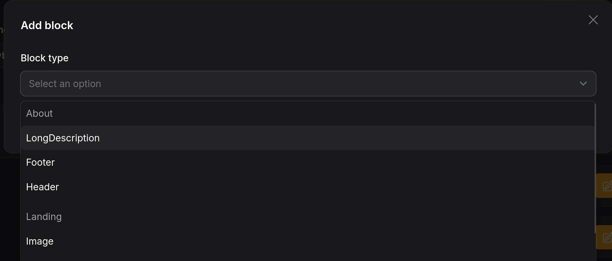
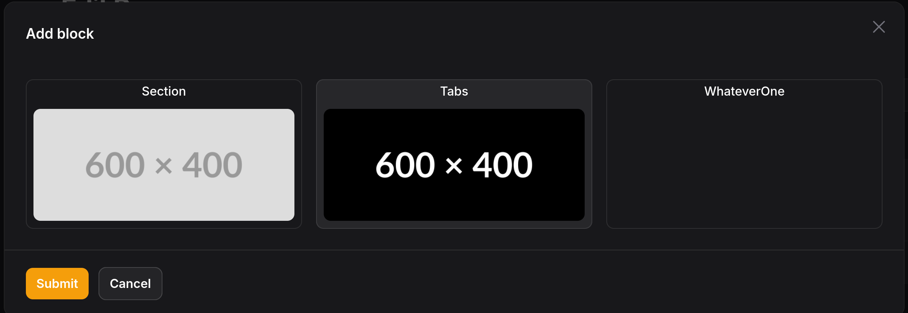
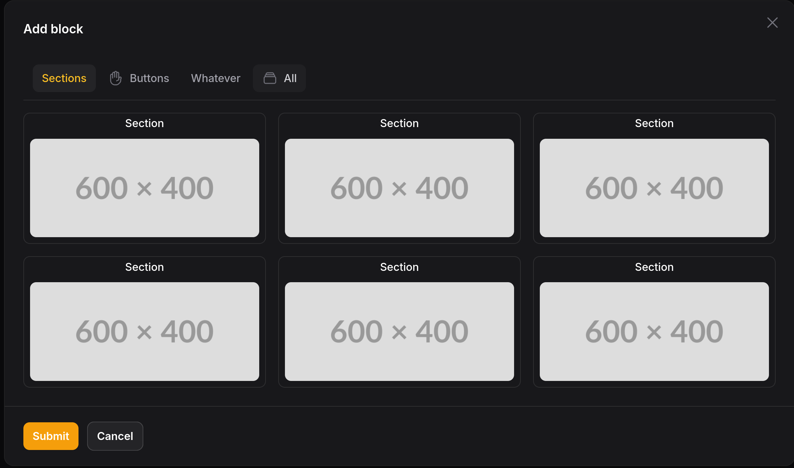

# Page builder plugin
[](https://packagist.org/packages/redberry/page-builder-plugin)
[](https://github.com/RedberryProducts/filament-page-builder-plugin/actions?query=workflow%3Arun-tests+branch%3Amain)
[](https://packagist.org/packages/redberry/page-builder-plugin)

- [Page builder plugin](#page-builder-plugin)
- [Introduction](#introduction)
- [Features](#features)
- [Installation](#installation)
  - [Pre-requisites](#pre-requisites)
- [Usage](#usage)
  - [Command for generating blocks](#command-for-generating-blocks)
  - [Additional configuration options](#additional-configuration-options)
    - [Enable reorders](#enable-reorders)
    - [Previewing in real time with iframe](#previewing-in-real-time-with-iframe)
    - [Formatting page builder data for preview](#formatting-page-builder-data-for-preview)
    - [Formatting block label](#formatting-block-label)
    - [grouping blocks](#grouping-blocks)
    - [Block categories](#block-categories)
    - [Showing thumbnail preview for a block](#showing-thumbnail-preview-for-a-block)
    - [disabling block in select block](#disabling-block-in-select-block)
    - [iframe resizing](#iframe-resizing)
    - [Parameter injection](#parameter-injection)
    - [Global blocks](#global-blocks)
    - [Rendering page builder items on infolist](#rendering-page-builder-items-on-infolist)
    - [Rendering page builder ite previews on fomrms](#rendering-page-builder-ite-previews-on-fomrms)
    - [Customizing actions and button rendering](#customizing-actions-and-button-rendering)
      - [Customizing buttons for actions](#customizing-buttons-for-actions)
- [Credits](#credits)
- [License](#license)


# Introduction

This FilamentPHP plugin is aimed at allowing you to seamlessly integrate page builder functionality into your Filament admin panel, preview changes in real-time via iframe or view files, and manage your content with ease using FilamentPHP form fields.

<video controls src="./assets/live-preview-small-demo.mp4" title="Title"></video>

# Features

- Predefined form and infolist component which can be fully customized
- Previewing changes in real-time via iframes or view files
- Easily customizable page builder block components
- Ability to use every FilamentPHP field inside component blocks
- Ability to fully customize formatting of page builder blocks
- Predefined table and trait for easily adding page builder functionality to your resources


# Installation

## Pre-requisites

- PHP 8.1 or higher
- Laravel 10.x or higher
- Filament 3.x

You can install the package via composer:

```bash
composer require redberry/page-builder-plugin
```

You can publish and run the migrations with:

```bash
php artisan vendor:publish --tag="page-builder-plugin-migrations"
php artisan migrate
```

Optionally, you can publish the config file using:

```bash
php artisan vendor:publish --tag="page-builder-plugin-config"
```

Optionally, you can publish the views using

```bash
php artisan vendor:publish --tag="page-builder-plugin-views"
```

# Usage

- add trait to the model you want to have page building functionality to

```php
<?php
use Redberry\PageBuilderPlugin\Traits\HasPageBuilder;

class Page extends Model
{
    use HasPageBuilder;
}
```
this trait simply adds relationship to the model.

- next add PageBuilder form field to schema which you want to have page builder, like this:
```php
<?php

$form->schema([
    PageBuilder::make('website_content')
        ->blocks([]),
]);
```
when blocks are empty it will not show any blocks, blocks can be created by running command:

```bash
php artisan page-builder-plugin:make-block --type=view
```
this command will create a block class in the `app/Filament/{id of admin panel}/Blocks` directory and also create a view file in the `resources/views/blocks/` directory.

in block class that you just created you will notice function `getBlockSchema`.

in `getBlockSchema` function you must return schema of the block, this blocks are rendered just like filament forms, so you can use any filament form field and their features inside the block.

for example:
```php
<?php

class Description extends BaseBlock
{
    public static function getBlockSchema(): array
    {
        return [
            RichEditor::make('text')
                ->required()
        ];
    }
}
```
- now you can add new block that we just created to the page builder field like this:
```php
<?php

$form->schema([
    PageBuilder::make('website_content')
        ->blocks([
            Description::class,
        ]),
]);
```

that's it, now you can add, edit and delete blocks to the page builder field.

## Command for generating blocks

since in most project there will be many blocks, we decided to write command for generating blocks, this command will create block class and view file if you specify type as an view, otherwise it will create only block class.

```bash
php artisan page-builder-plugin:make-block
```

if you wish to customize any of the files that are created by the command you can do so by publishing the stubs using this command:

```bash
php artisan vendor:publish --tag="page-builder-plugin-stubs"
```

and modify them to your heart's content.

## Additional configuration options

### Enable reorders
you can enable reordering of blocks by adding `reorderable()` method to the page builder field like this:

```php
<?php

$form->schema([
    PageBuilder::make('website_content')
        ->reorderable(),
]);

```

### Previewing in real time with iframe

by default components in preview are rendered using normal views, but sometimes you might want to preview them in iframe, in cases which components are located in another repository. 

to enable iframe previewing call `renderPreviewWithIframes` method on the page builder field like this:
```php
<?php

$form->schema([
    PageBuilder::make('website_content')
        ->renderPreviewWithIframes(
            condition: true,
            createUrl: 'http://localhost:5173',
        ),
]);
```

sadly this is not all and some configurations are required to be done on the website that you will be using preview for.
considering the fact that many frontend frameworks can not accept data right away from iframe you will need to notify filament about the fact that framework is fully hydrated and ready to load data, to do this after your framework is ready to be used run this code below:

```js
// replace * with the url of your filament admin panel
window.parent.postMessage({
      type: "readyForPreview",
}, "*");
```

this will send message to admin panel letting it know that page is ready to send data. to accept that data you will need to attach message event listener to the window like this:

```js
window.addEventListener("message", (event) => console.log(event.data));
```

and that it. now website rendered via iframe will receive data from filament in real time.

### Formatting page builder data for preview

sometimes there might be a case where you will have the need to format  the data before sending it to frontend for example retrieving full url for the image, this can be done by declaring `formatForSingleView` or `formatForListingView`  on a block like this:

```php
<?php

class Description extends BaseBlock
{
    // ...

    public static function formatForSingleView(array $data): array
    {
        $data['text'] = url($data['text']);
        $data['image'] = self::getUrlForFile($data['image']);

        return $data;
    }
}
```

`formatForListingView` also calls this function so no need to duplicate the code, data is the same.

Note that I'm using getUrlForFile. This is done because sometimes the image can be a temporary upload. This is just a helper for properly parsing the URL and returning it, so I would recommend using it.

### Formatting block label

there are multiple ways to change label of the block on on page builder.
if you just want to auto generate label based on one of the block attributes you can do so by declaring `getBlockTitleAttribute` and returning name of the attribute you want to use as a label, like this:

```php
<?php

class Description extends BaseBlock
{
    // ...

    public static function getBlockTitleAttribute(): string
    {
        return "logo.name";
    }
}
```

or if you want to completely customize label structure you can do so by declaring `getBlockLabel` function on base block class, like this:

```php
<?php

class Description extends BaseBlock
{
    // ...

    public static function getBlockLabel(array $state, ?int $index = null)
    {
        return data_get($state, $key) . $index;
    }
}
```


### grouping blocks

many times you will have too many blocks and will have the need to group them, this can be done by declaring 
`getCategory` method on BaseBlock class like so:

```php
class Description extends BaseBlock
{
    public static function getCategory(): string
    {
        return 'About';
    }
}
```

or you can use category class instead of just name to group them easier, you can create category class by running command:

```bash
php artisan page-builder-plugin:make-block-category
```

this will create a category class in `app/Filament/{id of admin panel}/BlockCategories` directory, you can then use this class to group blocks like this:

```php
<?php

namespace App\Filament\Admin\BlockCategories;

use Redberry\PageBuilderPlugin\Abstracts\BaseBlockCategory;

class Buttons extends BaseBlockCategory
{
    public static function getCategoryName(): string
    {
        return 'Buttons';
    }
}
```

this classes come more in play when using thumbnail mode of select block, you can read more about it in [Showing thumbnail preview for a block](#showing-thumbnail-preview-for-a-block) section.

result look will like this:

 
### Block categories

blocks can be categorized visually by adding `getCategory` function on a block class, return value of `getCategory` can be either normal string or class that extends `BaseBlockCategory` class, this class can be created by running command:

```bash
php artisan page-builder-plugin:make-block-category
```

this will create a category class in `app/Filament/{id of admin panel}/BlockCategories` directory, you can then use this class to group blocks like this:

```php
<?php

class Description extends BaseBlock
{
    public static function getCategory(): string
    {
        return TextFields::class;
    }
}
```

benefit of using category class is that there is lower chance of a typo on top of this category classes allow more customization when using [thumbnail previews](#showing-thumbnail-preview-for-a-block) for blocks by allowing you to add icons and customized other attributes for a filter tab.

you can customize category icon by adding `getCategoryIcon` method to the category class like this:

```php
<?php

namespace App\Filament\Admin\BlockCategories;

use Redberry\PageBuilderPlugin\Abstracts\BaseBlockCategory;

class Buttons extends BaseBlockCategory
{
    // ...

    public static function getCategoryIcon(): string
    {
        return 'heroicon-o-hand-raised';
    }
}
```

and you can customize other tab attributes by overriding `getCategoryAttributes` method like this:

```php
<?php

namespace App\Filament\Admin\BlockCategories;

use Redberry\PageBuilderPlugin\Abstracts\BaseBlockCategory;

class Buttons extends BaseBlockCategory
{
    // ...

    public static function getCategoryAttributes(): ComponentAttributeBag
    {
        return new ComponentAttributeBag([
            'class' => 'bg-blue-100 dark:bg-blue-900 text-blue-800 dark:text-blue-200',
        ]);
    }
}
```

default category type is 'all' it can be changed to class of the Category or the value, default can be changed like this:
```php
<?php

PageBuilder::make('website_content')
    ->selectBlockAction(function ( SelectBlockAction $action) {
        return $action->selectField(function (RadioButtonImage $field) {
                return $field->defaultCategory(Navigations::class);
            });
    });
```


### Showing thumbnail preview for a block

if you want to show thumbnail preview of a block using an image it can be done by declaring `getThumbnail` method on a block class and calling `renderWithThumbnails` method on the page builder field like this:

```php
<?php

class Description extends BaseBlock
{
    public static function getThumbnail(): string|Htmlable|null
    {
        return 'https://placehold.co/600x400/png';
    }
}

// in form schema

$form->schema([
    PageBuilder::make('website_content')
        ->blocks([Description::class])
        ->renderWithThumbnails(),
]);
```

which will render components like this:


if you are using categories for blocks it will look like this:



you can customized tabs by using [Block categories](#block-categories).

### disabling block in select block
if you want to disable block without removing it from the page builder you can do so by declaring `getIsSelectionDisabled` method on a block class like this:

```php
<?php

class Description extends BaseBlock
{
    public static function getIsSelectionDisabled(): bool
    {
        return true;
    }
}
```

### iframe resizing

iframe height can not be adjusted based on content of iframe because of CORS issues, because of this there are two ways to size iframe height to not cause components to hide.

one is to just provide default height to iframe like this:

for `PageBuilderPreview` and `PageBuilderPreviewEntry`:

```php
<?php

PageBuilderPreview::make('...')
    // ...
    ->iframeAttributes([
        'height' => '500px'
    ]);
])
```
or incase of `PageBuilder` like this:
```php
<?php

PageBuilder::make('...')
// ...
->createAction(function (PageBuilder $action) {
    return $action->pageBuilderPreviewField(function (PageBuilderPreview $field) {
        return $field->iframeUrl('http://localhost:5173')->autoResizeIframe()->iframeAttributes([
            'height' => '500px'
        ]);
    });
})
```

considering above solution is not the best, we provide ability to auto resize iframe height based  on frontend events, to do this first configure backend to track auto resize
   
for `PageBuilder` field:
```php
<?php

PageBuilder::make('...')
    ->renderPreviewWithIframes(
        condition: true,
        autoResize: true,
        createUrl: 'http://localhost:5173',
    ),
```
for `PageBuilderPreview` and `PageBuilderPreviewEntry` simply add `autoResizeIframe` method to the preview field like this:

```php
<?php

  PageBuilderPreview::make('...')
    // ...
    ->autoResizeIframe();
```

after configuring backend website that is rendered in iframe also needs some extra configuration. 
whenever height of the page changes you will need to send event to FilamentPHP like so:

```js
// replace * with the url of your filament admin panel
window.parent.postMessage(
    {
        height: document.body.scrollHeight,
        type: 'previewResized',
    },
    '*'
);
```

we recommend doing this on page load and on height change of the document, you can do this by using mutation observer.

whenever this event is received by filament it will resize iframe height to the height that is provided in the message.

### Parameter injection
there will be cases when you will need to modify data, schema, label based on some condition, because of this we provide parameter injection for methods declared on block class. parameter injection refers to declaring `$record` parameter for function and it getting injected with record that is being used on page similar to how filament works, for example:

```php
<?php

class Description extends BaseBlock
{
    // make sure that injecting parameter is nullable
    public static function getBlockSchema(?Model $record = null): array
    {
        return [
            RichEditor::make('text')
                ->default($record->text)
                ->required()
        ];
    }
}
```

this will inject record that is being used on page into `getBlockSchema` function, this works for all of the above mentioned functions.

injections that are provided depends on where this function is used, if this is used on infolist for example same parameters that can be injected in normal FilamentPHP can also be injected in one of the above functions, refer to FilamentPHP documentation about what parameters are available for injection.

one thing to note is that because `formatForListingView` uses `formatForSingleView` internally if you wish to inject something in `formatForSingleView` you will need to inject it in `formatForListingView` as well, otherwise it will not work.

### Global blocks

Global blocks are special blocks that have centralized configuration management. Instead of configuring the same block repeatedly across different pages, you can set up the block configuration once and reuse it everywhere.

#### Creating global blocks

You can create a global block using the make-block command with the `--global` flag:

```bash
php artisan page-builder-plugin:make-block ContactForm --type=view --global
```

This will:
- Create a global block class in `app/Filament/{panel}/Blocks/Globals/` directory
- Create a `Globals` block category for organization
- Show instructions for enabling the Global Blocks resource

#### Enabling the Global Blocks resource

To manage global blocks in your Filament admin panel, you need to register the GlobalBlocksPlugin in your panel provider:

```php
<?php

// In your AdminPanelProvider.php (or similar panel provider)

public function panel(Panel $panel): Panel
{
    return $panel
        // ... other configurations
        ->plugins([
            \Redberry\PageBuilderPlugin\GlobalBlocksPlugin::make(),
            // ... other plugins
        ]);
}
```

This will add a "Global Blocks" resource to your admin navigation under the "Content Management" group.

#### Configuring the Global Blocks plugin

You can configure the plugin directly when registering it:

```php
<?php

->plugins([
    \Redberry\PageBuilderPlugin\GlobalBlocksPlugin::make()
        ->enableGlobalBlocks(true) // Enable/disable the Global Blocks resource
        ->resource(\App\Filament\Resources\CustomGlobalBlocksResource::class), // Use custom resource
    // ... other plugins
])
```

**Configuration options:**
- `enableGlobalBlocks(bool)`: Enable or disable the Global Blocks resource (default: `true`)
- `resource(string)`: Specify a custom resource class that extends the package's resource

This approach allows you to:
- **Enable Global Blocks on specific panels only** - Perfect for multi-panel applications
- **Use different resource configurations per panel** - Each panel can have its own customized resource
- **Disable the feature entirely** by not registering the plugin or using `->enableGlobalBlocks(false)`

#### How global blocks work

Global blocks use the `IsGlobalBlock` trait and have two key methods:

```php
<?php

use Redberry\PageBuilderPlugin\Traits\IsGlobalBlock;

class ContactForm extends BaseBlock
{
    use IsGlobalBlock;

    // Define the block's schema - this will be used in the Global Blocks resource
    public static function getBaseBlockSchema(?object $record = null): array
    {
        return [
            TextInput::make('title')->required(),
            Textarea::make('description'),
            TextInput::make('email')->email(),
        ];
    }

    // The schema returned to the page builder (empty for global blocks)
    public static function getBlockSchema(?object $record = null): array
    {
        $schema = static::getBaseBlockSchema($record);
        return static::applyGlobalConfiguration($schema);
    }
}
```

#### Global Blocks resource

The "Global Blocks" resource is provided by the package and becomes available once you register the GlobalBlocksPlugin in your panel. This resource allows you to:

- View all available global blocks
- Configure each block's field values
- Edit configurations using the actual Filament form fields defined in `getBaseBlockSchema()`


#### Using global blocks on pages

When adding global blocks to pages:
- **No configuration modal appears** - blocks are added instantly
- **No per-page configuration** - all configuration is managed centrally
- **Consistent values everywhere** - the block uses the same configured values across all pages

Simply add your global block to the page builder's blocks array:

```php
<?php

PageBuilder::make('website_content')
    ->blocks([
        ContactForm::class,
        // other blocks...
    ]);
```

#### Key benefits

- **Centralized management**: Configure once, use everywhere
- **Consistency**: Same content and styling across all instances
- **Efficiency**: No need to reconfigure the same block on multiple pages
- **Maintainability**: Update global block configuration in one place

### Rendering page builder items on infolist
outside of form you might want to render page builder items on infolist, for this we provide two prebuilt entries:
`PageBuilderEntry` and `PageBuilderPreviewEntry`

`PageBuilderEntry` is used to render page builder items without rendering part itself,

`PageBuilderPreviewEntry` functions in same way that `PageBuilderPreview` does, but it is used to render page builder items on infolist which is about only difference.

both of these feature same type of confuguration including requirment to provide iframe urls, and blocks list.

example:
```php
<?php

$infolist
->schema([
    PageBuilderEntry::make('website_content')
        ->blocks([LongDescription::class])
        ->columnSpan(1),
    PageBuilderPreviewEntry::make('website_content_preview')
        ->blocks([LongDescription::class])
        ->iframeUrl('http://localhost:5173')
        ->autoResizeIframe()
        ->columnSpan(2),
]);
```

### Rendering page builder item previews on forms

by default preview is rendered for create and edit. the same component that is used in create and edit actions can be used for listing as well, all you have to do is add `PageBuilderPreview` to the schema  and provide name of `PageBuilder` field like so:

```php
<?php

PageBuilderPreview::make('website_content_preview')
    ->pageBuilderField('website_content')
    ->iframeUrl('http://localhost:5173')
    ->autoResizeIframe()
```

this will render preview of items selected in `PageBuilder` field and it will update in real time.

### Customizing actions and button rendering

only component which has actions is `PageBuilder`, all of this actions have their own modifier functions and are moved to the own class, so you can easily customize them, here is the list of actions, functions to modify them and their classes:

| Action name  | Class                           | Modifier function   |
| ------------ | ------------------------------- | ------------------- |
| Create       | `CreatePageBuilderBlockAction`  | `createAction`      |
| Edit         | `EditPageBuilderBlockAction`    | `editAction`        |
| Delete       | `DeletePageBuilderBlockAction`  | `deleteAction`      |
| Reorder      | `ReorderPageBuilderBlockAction` | `reorderAction`     |
| Select block | `SelectBlockAction`             | `selectBlockAction` |

#### Customizing buttons for actions
one strange thing about this package is how buttons are customized, because of how filamentphp actions are structured each button render comes with lot baggage to say so, multiple views, many checks and etc. while this is not too much of a problem if you are using couple of actions but due to nature of components for building a page there will be need for many many actions, 3 actions per component, its hard to quanitify exactly how much performance disadvantage this causes but in large project we first used this package in it became a massive problem to a point where removing those actions increase paged speeding 2-3 times, same numbers are replicable in this package on smaller scale as well, for example page which was rendering 65 components took around 500ms on local machine with using normal actions and no additional logic on their part while using simple buttons took around 150ms on average because of this drastic performance deference we decided to opt into using simple button rather than action. most buttons are rendered like this:

```php
<?php

return view('filament::components.button.index', [
    'slot' => $deleteAction->getLabel(),
    'labelSrOnly' => true,
    'icon' => 'heroicon-o-trash',
    'color' => 'danger',
    'disabled' => $deleteAction->isDisabled(),
    'attributes' => collect([
        'wire:click' => "mountFormComponentAction('$statePath', '{$this->getDeleteActionName()}', { item: '$item', index: '$index' } )",
    ]),
])
```

as you can see we are using filament button to render our buttons, this gives us advantage of having pretty much same capabilities as filament actions but without all the performance issues that come with using them.

this buttons can also be easily change, even the component view itself using modifier functions provided on `PageBuilder` component, this functions are injected with: `$action` `$item` `$index` and `$attributes` which can be injected via passing a closure to the modifier function,
this is a list of modifier functions and their corresponding actions:

| Action name | Modifier function     |
| ----------- | --------------------- |
| Delete      | `deleteActionButton`  |
| Edit        | `editActionButton`    |
| Reorder     | `reorderActionButton` |

here is example on how to use this modifier functions:

```php
<?php

PageBuilder::make('website_content')
    ->deleteActionButton(function ($action, $item, $index, $attributes) {
        return view('filament::components.button.index', 
            [
                ...$attributes,
                'id' => 'delete-button'
            ]
        );
    })
```

# Credits

- [Redberry](https://github.com/RedberryProducts)
- [GigaGiorgadze](https://github.com/GigaGiorgadze)

# License

The MIT License (MIT). Please see [License File](LICENSE.md) for more information.
